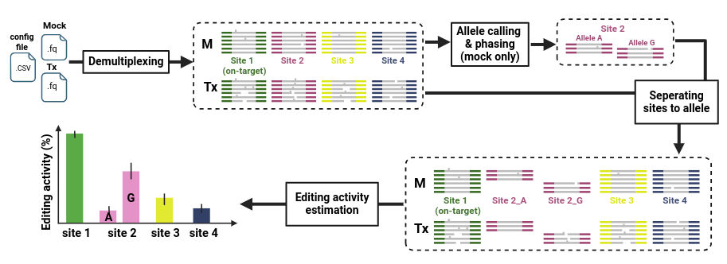

[](http://bioconda.github.io/recipes/CRISPECTOR2.0/README.html)

<p align="left">
  
</p>
#
CRISPECTOR2.0 is a software package designed to support the detection, evaluation, and quantification of an allele-specific on- and off-target genome editing activity. 
CRISPECTOR2.0 accepts FASTQ files resulting from running treatment vs. uedited (mock) experiments followed by multiplex-PCR and NGS. The tool determines and quantifies NHEJ edit activity at every interrogated locus **per allele**. CRISPECTOR2.0 also finds adverse translocation activity in all relevant pairs of loci.


**Contents:**
* [CRISPECTOR2.0 Workflow](#CRISPECTOR2.0-Workflow)
* [Installation](#Installation)
* [Usage](#Usage)
* [Citation](#Citation)

# CRISPECTOR2.0 Workflow  

Briefly, CRISPECTOR2.0 assigns each read in the treatment and mock FASTQ files to a specific locus of interest or a putative translocation. Then, it identifies SNVs and calls the alleles in the sample based on the mock files. Finally. CRISPECTOR2.0 applies statistical modeling to a Bayesian inference classifier that accurately estimates the NHEJ editing activity and a hypergeometric test is performed to detect translocation reads.

<p align="center">
  
</p>

# Installation

CRISPECTOR2.0 can be installed using the [conda](http://conda.pydata.org/docs/intro.html) package manager [Bioconda](https://bioconda.github.io/) (for Linux & macOS), or as a PIP package (for Linux & macOS).

### Bioconda
To install CRISPECTOR2.0 using Bioconda, download and install Anaconda Python 3.8, following the instructions at: https://www.anaconda.com/distribution/.

Open a terminal and type:

```
conda config --add channels defaults
conda config --add channels bioconda
conda config --add channels conda-forge
```

To install CRISPECTOR2.0 into the current conda environment, type:

```
conda install crispector2
```

If you don't already have an existing environment with Python 3.8, you can create one first (e.g. named `crispector_env`) with:

```
conda create -n crispector_env python=3.8
conda activate crispector_env
conda install crispector2
```

Check that CRISPECTOR2.0 is installed using the help command:

```
crispector --help
```

### PIP
To install CRISPECTOR2.0 using PIP, use:

```
python3 -m pip install crispector2
```

Additionally, FASTP package should be installed independently, using the instructions at: https://github.com/OpenGene/fastp

# Usage

CRISPECTOR2.0 is designed to run on two comparative NGS experiments - Treatment and Mock (control). CRISPECTOR2.0 has two running modes:
- **Multiplex-PCR input** (default mode) - CRISPECTOR2.0 assigns reads from the FASTQ files to target amplicons, as a pre-processing step.
- **Singleplex-PCR input** - In this mode, the input can be multiple singleplex-PCR for loci of the same experiment. Note, in this mode, CRISPECTOR2.0 won't detect translocations (translocation reads are only amplified in a multiplex-PCR reaction).  Also, do not mix singleplex FASTQ files from different experiments. CRISPECTOR2.0 evaluates NHEJ editing activity with respect to the experiment background noise. Thus, mixing experiments will cause wrong background noise estimation. 

## Multiplex-PCR input
CRISPECTOR2.0 requires three parameters: 
1. **Treatment input sequences** in the form of FASTQ files. Given by the  `-t_r1`  and  `-t_r2` arguments.  If the input is already pair-end merged or is a single-end, then omit `-t_r2`. FASTQ files can be gzip-compressed.
2. **Mock input sequences** in the form of FASTQ files. Given by the  `-m_r1`  and  `-m_r2`  arguments.  If the input is already pair-end merged, then omit `-m_r2`.  FASTQ files can be gzip-compressed.
3.  An **experiment config file** (given by the `-c` argument). The experiment description in a CSV (Comma Separated Values‏) format. Template can be found [here](https://github.com/YakhiniGroup/crispector/blob/master/example/experiment_config_template.csv). The table has 11 columns:
	-  **SiteName** [REQUIRED] - an identifier for the reference locus. 
	- **AmpliconReference**  [REQUIRED] - amplicon sequence used for the experiment (5'->3').
	- **gRNA** [REQUIRED] - gRNA sequence for each locus site. sequence should be supplied without the PAM sequence and without insertions or deletions.
	-  **OnTarget**  [REQUIRED] - a boolean indicating if the site is on-target (`True`) or off-target (`False`). 
	- **ForwardPrimer** [Optional] - forward primers as were used in the experiment. If not supplied, primers are inferred from the amplicon reference.
	- 	**ReversePrimer** [Optional] - reverse primers as were used in the experiment. If not supplied, primers are inferred from the amplicon reference.
	- **TxInput1Path** - Leave empty for experiment with multiplexed input. 
	- **TxInput2Path** - Leave empty for experiment with multiplexed input. 
	- **MockInput1Path** - Leave empty for experiment with multiplexed input. 
	- **MockInput2Path** - Leave empty for experiment with multiplexed input. 
	- **DonorReference**  [Optional] - If experiment is designed with HDR, then insert the amplicon sequence in the on-target row. Note that editing HDR activity isn't evaluated by CRISPECTOR2.0. 
	
	Where data is not available, leave the cell empty. If an entire column is empty, leave the entire column empty. 


**Command:**
```
crispector --allele -t_r1 tx_R1.fq.gz -t_r2 tx_R2.fq.gz -m_r1 mock_R1.fq.gz -m_r2 mock_R2.fq.gz -c exp_config.csv
```
Alternatively, you can also run CRISPECTOR without allele analysis, using the command:
```
crispector -t_r1 tx_R1.fq.gz -t_r2 tx_R2.fq.gz -m_r1 mock_R1.fq.gz -m_r2 mock_R2.fq.gz -c exp_config.csv
```
**Example:**
You can download data and configuration for CD33-846 experiment (performed with [rhAmpSeq](https://eu.idtdna.com/pages/products/next-generation-sequencing/amplicon-sequencing?utm_source=google&utm_medium=cpc&utm_campaign=ga_rhampseq&utm_content=ad_group_rhampseq&gclid=Cj0KCQjw3qzzBRDnARIsAECmryqo5fO62fqk95a4PfkqES-9G07br5kdtTpjJInnYFjqYw2OxYI2gRwaAmTQEALw_wcB)) . The experiment was designed with one on-target site and 45 off-target sites.
The compressed experiment files can be found [here](https://github.com/TheAGuy/crispector2), and it contains the following files: 
- CD33-846_config.csv
- CD33-846-tx-500K.r1.fastq.gz
- CD33-846-tx-500K.r2.fastq.gz
- CD33-846-mock-500K.r1.fastq.gz
- CD33-846-mock-500K.r2.fastq.gz

The FASTQ files contain the first 500,000 reads of the experiment. Full sequencing can be found in [NCBI](https://www.ncbi.nlm.nih.gov/sra) as NCBI accession: **PRJNA998321**. 

```
CRISPECTOR --allele -t_r1 CD33-846-tx-500K.r1.fastq.gz -t_r2 CD33-846-tx-500K.r2.fastq.gz -m_r1 CD33-846-mock-500K.r1.fastq.gz -m_r2 CD33-846-mock-500K.r2.fastq.gz -c CD33-846_config.csv
``` 

## Singleplex-PCR input 
Usage with singleplex-PCR input (FASTQ file for each locus site) is identical to multiplex-PCR input with the following exception - Full paths to the FASTQ files are given in the **experiment config file** (`-c`), instead of the command-line arguments (`-t_r1`, `-t_r2`, `-m_r1` & `-m_r2`).  
The FASTQ file paths should be supplied for each target locus in the following experiment configuration columns:
- **TxInput1Path** and **TxInput2Path** - Full paths of  treatment input sequences in the form of FASTQ files.  If the input is already pair-end merged or is a single-end, then leave the column **TxInput2Path** empty. FASTQ files can be gzip-compressed.
- **MockInput1Path**  and **MockInput2Path** - Full paths of mock input sequences in the form of FASTQ files.  If the input is already pair-end merged or is a single-end, then leave the column **MockInput2Path** empty. FASTQ files can be gzip-compressed.

All other columns of   **experiment config file** (`-c`) should be specified as in multiplex-PCR input.
	
**Command:**
```
CRISPECTOR2 --allele -c exp_config.csv
```
**Example:**
You can download data and configuration for EMX1 experiment (performed with [rhAmpSeq](https://eu.idtdna.com/pages/products/next-generation-sequencing/amplicon-sequencing?utm_source=google&utm_medium=cpc&utm_campaign=ga_rhampseq&utm_content=ad_group_rhampseq&gclid=Cj0KCQjw3qzzBRDnARIsAECmryqo5fO62fqk95a4PfkqES-9G07br5kdtTpjJInnYFjqYw2OxYI2gRwaAmTQEALw_wcB)). Experiment was designed with one on-target site and 10 off-target sites. The FASTQ files contain the first 5,000 reads for each target locus. Loci Sites were binned into separated FASTQ files using bowtie2. The compressed experiment files can be found [here](https://github.com/YakhiniGroup/crispector/raw/master/example/EMX1_11_sites_singleplex_input_500k_reads.zip). Make sure you change "PATH_TO_DIRECTORY" in the "EMX1_config.csv" file to your local directory path. 

```
crispector --allele -c EMX1_config.csv
``` 


## All optional parameters 
Relevant for both running modes - Multiplex and singleplex input.
````
Usage: crispector [OPTIONS]

  Accurate estimation of off-target editing activity from comparative NGS data

Options:
  -t_r1, --tx_in1 PATH            Tx read 1 input path or Tx merged FASTQ file
  -t_r2, --tx_in2 PATH            Tx read 2 input path, if FASTQ files aren't
                                  merged [OPTIONAL]
  -m_r1, --mock_in1 PATH          Mock read 1 input path or mock merged FASTQ
                                  file
  -m_r2, --mock_in2 PATH          Mock read read 2 input path, if FASTQ files
                                  aren't merged [OPTIONAL]
  -c, --experiment_config PATH    A CSV (Comma Separated Values‏) file with
                                  the experiment data. Table has 11 columns:
                                  SiteName, AmpliconReference, gRNA, OnTarget,
                                  ForwardPrimer, ReversePrimer,TxInput1Path
                                  TxInput2Path, MockInput1Path,
                                  MockInput2Path, DonorReference. The first 4
                                  columns are required, the rest are optional.
                                  Header should be specified by the above
                                  order. Please check the README on GitHub
                                  further details and examples.  [required]
  -o, --report_output PATH        Path to output folder
  --cut_site_position INTEGER     Expected cut-site position with respect to
                                  the 3' end of the provided sgRNA sequence.
                                  Note, the sgRNA sequence must be entered
                                  without the PAM.  [default: -3]
  --crispector_config PATH        Path to crispector configuration in YAML
                                  format.See "Advanced usage" section in
                                  README on GitHub for further.
  --fastp_options_string TEXT     Try "fastp --help" for more details
  --min_num_of_reads INTEGER      Minimum number of reads (per locus site) to
                                  evaluate edit events  [default: 500]
  --min_read_length_without_primers INTEGER
                                  Filter out any read shorter than
                                  min_read_length_without_primers + length of
                                  forward and reverse primers. This threshold
                                  filters primer-dimmer effect reads.
                                  [default: 10]
  --max_edit_distance_on_primers INTEGER
                                  Maximum edit distance to consider a read
                                  prefix (or suffix) as a match for a primer.
                                  [default: 8]
  --amplicon_min_score FLOAT RANGE
                                  Minimum normalized alignment score to
                                  consider a read alignment as valid.
                                  Normalized alignment score is defined as the
                                  Needleman-Wunch alignment score divided by
                                  the maximum possible score. Below this
                                  alignment threshold, reads are discarded.
                                  [default: 30; 0<=x<=100]
  --translocation_amplicon_min_score FLOAT RANGE
                                  Minimum alignment score to consider a read
                                  with primer inconsistency as a possible
                                  translocation. Should be higher than
                                  --amplicon_min_score, because translocations
                                  reads are noisier.Score is normalized
                                  between 0 (not even one bp match) to 100
                                  (read is identical to the reference)
                                  [default: 80; 0<=x<=100]
  --min_editing_activity FLOAT RANGE
                                  Minimum editing activity (%). Sites with
                                  editing activity lower than the minimum,
                                  will be discarded from the translocation
                                  detection.  [default: 0.1; x<=None]
  --translocation_p_value FLOAT RANGE
                                  Translocations statistical significance
                                  level. This threshold is applied on the
                                  corrected p_value,FDR (false discovery
                                  rate).  [default: 0.05; x<=None]
  --disable_translocations        Disable translocations detection  [default:
                                  False]
  --override_noise_estimation     Override noise estimation with default q
                                  parameter from crispector_config file. It's
                                  advisable to set this flag for experiment
                                  with a low number of off-target sites (<5).
                                  q is defined as the probability of an indel
                                  to occur through an edit event. Check
                                  CRISPECTOR paper for more details.
                                  [default: False]
  --confidence_interval FLOAT RANGE
                                  Confidence interval for the evaluated
                                  editing activity  [default: 0.95; 0<=x<=1]
  --enable_substitutions          Enable substitutions events for the
                                  quantification of edit events  [default:
                                  False]
  --suppress_site_output          Do not create plots for sites (save memory
                                  and runtime)  [default: False]
  --keep_intermediate_files       Keep intermediate files for debug purposes
                                  [default: False; required]
  --verbose                       Higher verbosity  [default: False]
  --snv_ratio TEXT                For a single position along single
                                  amplicon's data reads, if the entropy of the
                                  ratio is lower than the given ratio, don't
                                  count this position as potential snv. Has to
                                  be tuple that sums to 1  [default:
                                  (0.8,0.2)]
  --max_potential_snvs INTEGER    Maximum possible SNVs that may be occur in
                                  the experiment. Above that - certainly
                                  noise.  [default: 5]
  --max_allele_mismatches INTEGER
                                  maximum mismatches allowed when aligning
                                  guide to amplicon (both mock and tx) in the
                                  allelic case  [default: 5]
  --max_len_snv_ctc INTEGER       maximum length from cut site to snv that
                                  consider to be close to cut-site (ctc)
                                  [default: 10]
  --random_reads_percentage_threshold FLOAT
                                  The percentage of reads that if the
                                  algorithm cannot decide to which allele to
                                  classify them, this site won't be analyzed
                                  in the allele case  [default: 0.5]
  --allele                        Flag for analyzing alleles. The default is
                                  False, however if alleles are  needed, set
                                  the flag  [default: False]
  -h, --help                      Show this message and exit.
````
## Advanced usage - CRISPECTOR configuration file
Advanced users can further tune CRISPECTOR parameters using CRISPECTOR's configuration file. A path to an alternative configuartion file can be given to CRISPECTOR with (`--crispector_config <configuration_file_path>`). The default configuration file (which can be found [here](https://github.com/YakhiniGroup/crispector/blob/master/crispector/config/default_config.yml)) can be copied and replaced with alternative values. 
Two main parameter types can be tuned in the configuration file:
1. Alignment
2. NHEJ inference

### Alignment
Parameters for Needleman-Wunch algorithm:
- match_score (int): Match option for Needleman-Wunsch alignment (default: 5) 
- mismatch_score [int]: Mismatch option for Needleman-Wunsch alignment (default: -4) 
- open_gap_score [int]: Gap open option for Needleman-Wunsch alignment (default: -25) 
- extend_gap_score [int]: Gap extend option for Needleman-Wunsch alignment (default: 0)   
- substitution_matrix [string]: Replace mismatch_score option with a matrix score. Any substitution matrix name from [BioPython](http://biopython.org/DIST/docs/tutorial/Tutorial.html)  (substitution_matrices from Bio.Align) can be used. E.g.  "blosum62".  (default: "", meaning no substitution matrix)
### NHEJ inference
Parameters for NHEJ inference. This option is advisable only for users that read CRISPECTOR paper (see [Citation](#Citation)):
- default_q  [int] - The probability of an indel to occur through an edit event. Used when `--override_noise_estimation` is set. (default: -3).
- window_size [int] - Defines the size (in bp) of the window extending from the position of the expected cut-site. Outside this window, indels won't be accounted as edits. Changing this field requries changing the *prior probability* for each indel type as well (default: 10)
- IndelType: An hierarchical bundle of parameters that defines the indel types and their *prior probabilities* (as defined in CRISPECTOR paper). For each indel type (Deletion, Insertions, Substitutions or Mixed) user can define the aggregation level for different indel lengths and the indel type *prior probability*. For example, consider the following:  
	 ```` 
	 Deletions:  
	    del_len_1:  
	        min: 1  # min indel length
	        max: 1  # max indel length
	        pos_prior: [0.0001, 0.0001, 0.0001, 0.0001, 0.0001, 0.0001, 0.0001, 0.001, 0.1, 0.5,  
	                    0.5, 0.1, 0.001, 0.0001, 0.0001, 0.0001, 0.0001, 0.0001, 0.0001, 0.0001]
	````
	The user defined indel type for deletion of length 1 (because only length 1  belongs to  [`min`, `max`]). The user also defined the *prior probability* (`pos_prior`) for every bp in the window around the expected cut-site. The expected cut-site is located right to the middle index. In the above example, window size is 10, therefore the expected cut-site is between index 10 and 11 (between `0.5, 0.5`).  The *prior probability*  is symmetrical around the expected cut-site. Thus, the length of the `pos_prior` list is 2*`window_size`, except for `Insertions` where it's 2*`window_size` + 1. That's because Insertions are defined between reference sequence bases, and not "on" them. Please note that `del_len_1` is just  the name of the indel type, and it doesn't affect anything else.  
	
## CRISPECTOR2.0 output - HTML-based report
CRISPECTOR generates an HTML-based report to support user interpretation and further analysis of the outcomes. A compressed output directory example can be found [here](https://github.com/YakhiniGroup/crispector/raw/master/example/EMX1_11_sites_50k_reads_output.zip). Once downloaded, apply "Extract all" or "Unzip here" with a zip application (such as Winzip) and open "report.html". The report is best viewed through Google Chrome. 

The report contains plots and tables that summarize the experiment results. For example multiple off-target editing activity including statistical confidence indicators and translocation results. The report also contains read statistics, such as the number of assigned and aligned reads in each processing step in the different loci. 
In addition, plots are generated for each individual locus: distribution of edit events, classifier results for each modification type and reference position, and alignments of all edited reads, in a graphical format.
 Furthermore, all aligned reads in treatment and mock, whether assigned to a specific locus or determined as primer inconsistent (and therefore maybe representing a translocation event), are saved in a set of CSV files.

# Citation
########################################.

# Permissions
Permission has been granted to Bioconda to distribute CRISPECTOR2.0 under the end user license agreement at [URL](https://github.com/bioconda/bioconda-recipes/pull/21129)
